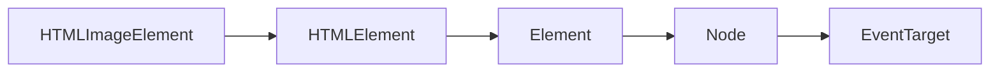
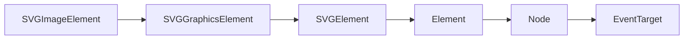
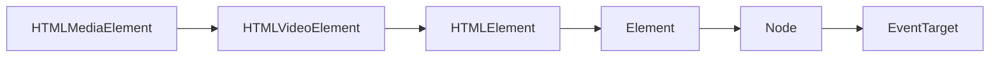
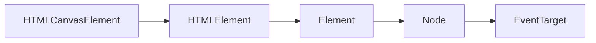

# 绘制图形 drawImage

<script lang="ts" setup>
    import DrawVideo from '@/views/canvas/DrawVideo.vue';
    import DrawVideoSplitScreen from '@/views/canvas/DrawVideoSplitScreen.vue';
    import DrawVideoSplicing from '@/views/canvas/DrawVideoSplicing.vue';
    import DrawVideoSplitCopy from '@/views/canvas/DrawVideoSplitCopy.vue';
    import DrawVideoGreenScreen from '@/views/canvas/DrawVideoGreenScreen.vue';
</script>

**drawImage(image: CanvasImageSource, ...)**
`CanvasImageSource`是一个辅助类型，它不是一个接口，也没有对象实现它。

描述下面类型的任何一个对象

- **[CSSImageValue](https://developer.mozilla.org/en-US/docs/Web/API/CSSImageValue)**
:::warning 实验性：
实验中的产品
:::

- **[HTMLImageElement](https://developer.mozilla.org/zh-CN/docs/Web/API/HTMLImageElement)**
HTML中常用的标签元素，可以是页面中的DOM``对象，也可以是内存中创建的IMG`Image`对象。


- **[SVGImageElement](https://developer.mozilla.org/en-US/docs/Web/API/SVGImageElement)**
 也就是SVG中的`<image>`元素。该接口继承关系如下图：



- **[HTMLVideoElement](https://developer.mozilla.org/es/docs/Web/API/HTMLVideoElement)**
  接口提供了用于操作视频对象的特殊属性和方法：


- **[HTMLCanvasElement](https://developer.mozilla.org/zh-CN/docs/Web/API/HTMLCanvasElement)**
接口提供用于操纵`<canvas>`元素的布局和表示的属性和方法。


- **[ImageBitmap](https://developer.mozilla.org/zh-CN/docs/Web/API/ImageBitmap)**
接口表示能够被绘制到`<canvas>`上的位图图像，具有低延迟的特性。运用 [createImageBitmap()](https://developer.mozilla.org/en-US/docs/Web/API/createImageBitmap) 工厂方法模式，它可以从多种源中生成。`ImageBitmap`提供了一种异步且高资源利用率的方式来为 WebGL 的渲染准备基础结构。
:::details 示例
```js
var canvas = document.getElementById('myCanvas'),
ctx = canvas.getContext('2d'),
image = new Image();

image.onload = function() {
  Promise.all([
    createImageBitmap(this, 0, 0, 32, 32),
    createImageBitmap(this, 32, 0, 32, 32)
  ]).then(function(sprites) {
    ctx.drawImage(sprites[0], 0, 0);
    ctx.drawImage(sprites[1], 32, 32);
  });
}

image.src = 'sprites.png';
```
:::

- **[OffscreenCanvas](https://developer.mozilla.org/zh-CN/docs/Web/API/OffscreenCanvas)**
OffscreenCanvas 提供了一个可以脱离屏幕渲染的*canvas*对象。它在窗口环境和web worker环境均有效。


## 绘制视频(HTMLVideoElement)

视频播放中，把每一帧图像绘制到画布上，形成一幅视频动画。

```js
if (context && videoElement instanceof HTMLVideoElement) {
    context.clearRect(0, 0, videoElement.offsetWidth, videoElement.offsetHeight);
    context.drawImage(videoElement, 0, 0, videoElement.offsetWidth, videoElement.offsetHeight);
}
```

- **clearRect(x, y, width, height)** 通过把像素设置为透明以达到擦除一个矩形区域的目的。

| 属性   | 默认值 | 描述                  |
| :----- | :----- | :-------------------- |
| x      | 0      | 矩形起点的 x 轴坐标。 |
| y      | 0      | 矩形起点的 y 轴坐标。 |
| width  | 0      | 矩形的宽度(px)        |
| height | 0      | 矩形的高度(px)        |

- **[drawImage()](https://developer.mozilla.org/zh-CN/docs/Web/API/CanvasRenderingContext2D/drawImage)** 提供了多种在画布（Canvas）上绘制图像的方式

```js
drawImage(image, dx, dy)
drawImage(image, dx, dy, dWidth, dHeight)
drawImage(image, sx, sy, sWidth, sHeight, dx, dy, dWidth, dHeight)
```

| 属性    | 默认值 | 描述                                                        |
| :------ | :----: | :---------------------------------------------------------- |
| image   |   -    | 绘制到上下文的元素                                          |
| sx      |   0    | 目标上下文中的, image 的矩形（裁剪）选择框的左上角 X 轴坐标 |
| sy      |   0    | 目标上下文中的, image 的矩形（裁剪）选择框的左上角 Y 轴坐标 |
| sWidth  |   0    | 目标上下文中的, image 的矩形（裁剪）选择框的宽度            |
| sHeight |   0    | 目标上下文中的, image的矩形（裁剪）选择框的高度             |
| dx      |   0    | image 的左上角在目标画布上 X 轴坐标                         |
| dy      |   0    | image 的左上角在目标画布上 Y 轴坐标                         |
| dWidth  |   0    | image 在目标画布上绘制的宽度                                |
| dHeight |   0    | image 在目标画布上绘制的高度                                |

:::details  查看示例 
<DrawVideo></DrawVideo>
:::

:::details 查看源码
@[code](@src/views/canvas/DrawVideo.vue)
:::

## 克隆视频画面

:::details  查看示例 
<DrawVideoSplitScreen></DrawVideoSplitScreen>
:::

:::details 查看源码
@[code](@src/views/canvas/DrawVideoSplitScreen.vue)
:::


## 分割视频画面

:::details  查看示例 
<DrawVideoSplicing></DrawVideoSplicing>
:::

:::details 查看源码
@[code](@src/views/canvas/DrawVideoSplicing.vue)
:::


## 分割视频拷贝画面

分割视频画面，把片段显示到多个`canvas`上

:::details  查看示例 
<DrawVideoSplitCopy></DrawVideoSplitCopy>
:::

:::details 查看源码
@[code](@src/views/canvas/DrawVideoSplitCopy.vue)
:::


# 读取图形数据 getImageData

`getImageData()`方法返回一个*ImageData*对象，该对象复制画布上指定矩形的像素数据。

:::warning 注意： 
*ImageData*对象不是图片，它指定画布上的一个部分（矩形），并保存该矩形内每个像素的信息。
:::

对于*ImageData*对象中的每个像素，有四条信息，即RGBA值：
- **R** - 红色（从0到255）
- **G** - 绿色（从0到255）
- **B** - 蓝色（从0到255）
- **A** - Alpha通道（从0到255; 0是透明的，255是完全可见）


## 视频实时抠图

去除视频中指定颜色(绿色)等，达到实时抠图效果。

获取画面帧中像素点数据
```js
let imageData: ImageData = context.getImageData(0, 0, videoElement.offsetWidth, videoElement.offsetHeight);
console.log('Pixel points', imageData.data.length/4);
```

去除像素点中绿色
```js
for (let i = 0; i < points; i++) {
    let r = imageData.data[i * 4 + 0];//Red
    let g = imageData.data[i * 4 + 1];//Green
    let b = imageData.data[i * 4 + 2];//Blue

    if (r === 0 && g === 255 && b = 0) {
        imageData.data[i * 4 + 3] = 0;//Alpha
    }
}
```
最后清空画布，重新添加数据到上下文
```js
context.clearRect(0, 0, videoElement.offsetWidth, videoElement.offsetHeight);
context.putImageData(imageData, 0, 0);
```

:::details  查看示例
<DrawVideoGreenScreen></DrawVideoGreenScreen>
:::

:::details 查看源码
@[code](@src/views/canvas/DrawVideoGreenScreen.vue)
:::