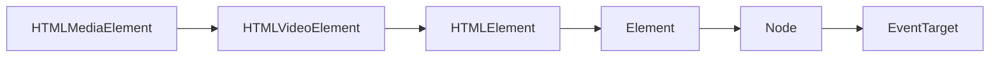

# 绘制图形 drawImage


**drawImage(image: CanvasImageSource, ...)**
`CanvasImageSource`是一个辅助类型，它不是一个接口，也没有对象实现它。

描述下面类型的任何一个对象

- **[CSSImageValue](https://developer.mozilla.org/en-US/docs/Web/API/CSSImageValue)**
:::warning 实验性：
实验中的产品
:::

- **[HTMLImageElement](https://developer.mozilla.org/zh-CN/docs/Web/API/HTMLImageElement)**
HTML中常用的标签元素，可以是页面中的DOM``对象，也可以是内存中创建的IMG`Image`对象。

- **[SVGImageElement](https://developer.mozilla.org/en-US/docs/Web/API/SVGImageElement)**
 也就是SVG中的`<image>`元素。该接口继承关系如下图：


- **[HTMLVideoElement](https://developer.mozilla.org/es/docs/Web/API/HTMLVideoElement)**
  接口提供了用于操作视频对象的特殊属性和方法：


- **[HTMLCanvasElement](https://developer.mozilla.org/zh-CN/docs/Web/API/HTMLCanvasElement)**
接口提供用于操纵`<canvas>`元素的布局和表示的属性和方法。


- **[ImageBitmap](https://developer.mozilla.org/zh-CN/docs/Web/API/ImageBitmap)**
接口表示能够被绘制到`<canvas>`上的位图图像，具有低延迟的特性。运用 [createImageBitmap()](https://developer.mozilla.org/en-US/docs/Web/API/createImageBitmap) 工厂方法模式，它可以从多种源中生成。
- OffscreenCanvas


## 绘制视频(HTMLVideoElement)

```js
if (context && videoElement instanceof HTMLVideoElement) {
    context.clearRect(0, 0, videoElement.offsetWidth, videoElement.offsetHeight);
    context.drawImage(videoElement, 0, 0, videoElement.offsetWidth, videoElement.offsetHeight);
}
```
:::: code-group
::: code-group-item 示例
<DrawVideo></DrawVideo>
:::
::: code-group-item 源码
@[code](@src/views/canvas/DrawVideo.vue)
:::
::::


<script lang="ts" setup>
    import DrawVideo from '@/views/canvas/DrawVideo.vue';
</script>